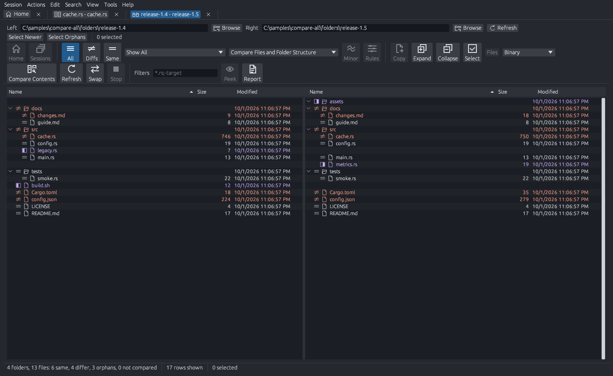
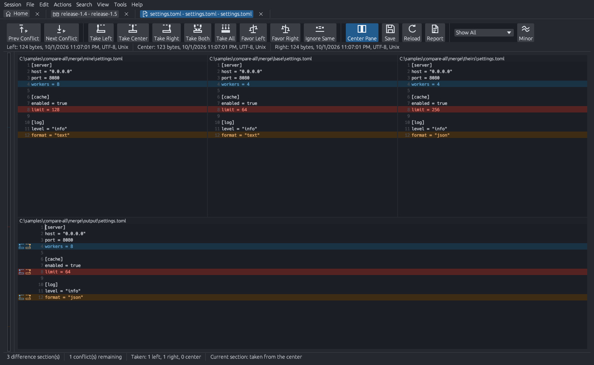

# compare-all

[](https://github.com/jasonulbright/compare-all/actions/workflows/ci.yml)
[](https://github.com/jasonulbright/compare-all/actions/workflows/release.yml)
[](https://github.com/jasonulbright/compare-all/releases/latest)
[](https://github.com/jasonulbright/compare-all/releases)
[](#platforms)
[](#build-from-source)
[](LICENSE)

compare-all compares files and folders. It shows the differences side by
side. It can also merge, synchronize, and edit. It is written in Rust and uses
the egui toolkit.



## Platforms

- Windows x64
- Linux x86_64
- macOS on Apple silicon (aarch64)

## Comparison types

| Type | Use |
|---|---|
| Folder Compare | Find the files that are new, missing, or different in two folders. |
| Folder Merge | Combine two folders into an output folder. |
| Folder Sync | Copy changes from one folder to the other, or both ways. |
| Text Compare | Compare two text files line by line. Edit and save each side. |
| Text Merge | Merge two or three text files into one output file. |
| Table Compare | Compare CSV and other delimited data by row and column. |
| Hex Compare | Compare two binary files byte by byte. |
| Picture Compare | Compare two images and mark the different pixels. |
| Registry Compare | Compare Windows registry keys and exported registry files. |
| Version Compare | Compare the version resources of two executables. |
| Media Compare | Compare the tags and stream facts of two media files. |

A side of a comparison can be a local path, an archive, or a remote location.
Text Compare highlights the syntax of common data formats and programming
languages. For JSON and XML, View > Compare Structure compares paths and
values instead of lines.




## Install

Open the Releases page of this repository. Each release has these files:

- `compare-all-<version>-x64.msi`: the Windows installer.
- A Windows zip file: the programs without an installer.
- Linux and macOS `.tar.gz` files, and a Linux AppImage.
- A `.sha256` file for each download.

Compare the SHA-256 sum of a download with its `.sha256` file before you open
it.

### Unsigned builds and SmartScreen

The Linux and macOS builds are not signed. A build that you make from source
is not signed. Windows SmartScreen can show a warning when you start an
unsigned program or a program that few people have downloaded. To continue,
select More info, then Run anyway. On macOS, Gatekeeper can stop an unsigned
program. To continue, open the program from Finder with Control-click, then
select Open.

## Build from source

1. Install `rustup`. The file `rust-toolchain.toml` sets the Rust version.
   `rustup` installs that version at the first build.
2. On Linux, install the GTK 3 development package. On Debian and Ubuntu, run
   `sudo apt-get install libgtk-3-dev`.
3. Clone this repository.
4. Run `cargo xtask build --workspace --release`.

The release build writes two programs to `target/release`:

- `compare-all` opens the window.
- `ca` runs in a console and opens no window.

To run the checks, use these commands:

```text
cargo fmt --all --check
cargo clippy --workspace --all-targets -- -D warnings
cargo test --workspace
```

To build the Windows installer, install the WiX tool and run
`cargo xtask package`.

## Command line

`compare-all` accepts one to four paths:

- Two folders or two archives open a folder comparison.
- Two files open a text comparison.
- Three or four paths open a merge. The order is left, right, center, output.

```text
compare-all old.txt new.txt
compare-all /fv=hex-compare old.bin new.bin
compare-all mine.txt theirs.txt base.txt /mergeoutput=result.txt
```

`ca` compares in a console. A switch can start with `/`, `-`, or `--`.
`ca /?` shows all switches and exit codes.

| Command | Result |
|---|---|
| `ca /qc=binary a.bin b.bin` | Compare two files. The exit code gives the result. |
| `ca text a.txt b.txt` | Write the line ranges that differ. |
| `ca folder dir1 dir2` | Write the differences between two folders. |
| `ca @script.txt /dry-run src dst` | Show the plan of a script. Write nothing. |

In a script, `%1` to `%9` are the arguments after the script name. This script
makes the right folder a copy of the left folder:

```text
load "%1" "%2"
sync mirror:left->right
```

## Use as a difftool

### Git

Add these lines to your Git configuration. Change the path if you installed
compare-all in a different folder.

```ini
[diff]
    tool = compare-all
[difftool "compare-all"]
    cmd = \"C:/Program Files/compare-all/compare-all.exe\" \"$LOCAL\" \"$REMOTE\"
[merge]
    tool = compare-all
[mergetool "compare-all"]
    cmd = \"C:/Program Files/compare-all/compare-all.exe\" \"$LOCAL\" \"$REMOTE\" \"$BASE\" \"$MERGED\"
```

Then run `git difftool` or `git mergetool`.

### Visual Studio

Visual Studio uses the Git difftool and mergetool settings above for Git
repositories.

For Team Foundation Version Control, open Tools > Options > Source Control >
Visual Studio Team Foundation Server > Configure User Tools. Add a Compare
operation for the file extension `.*`. Select `compare-all.exe` as the
command. Use these arguments:

```text
"%1" /title1="%6" "%2" /title2="%7"
```

The pane titles show the names from Visual Studio. The comparison reads the
files at the paths that Visual Studio gives.

## License

compare-all is licensed under the MIT license. See [LICENSE](LICENSE).
The licenses of third-party components are in
[THIRD-PARTY-NOTICES.md](THIRD-PARTY-NOTICES.md).
